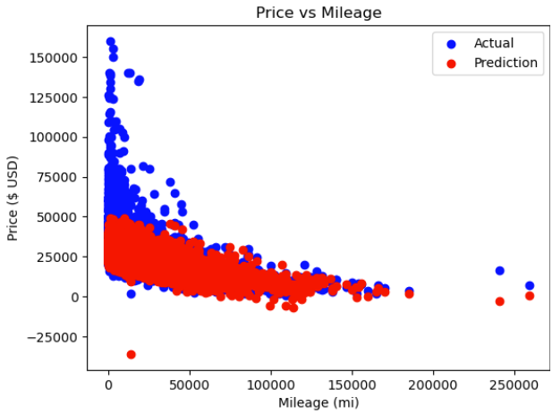

# Price Predictor

Price predictor is a program that creates predictive model(s) for used car prices ($).

The model chosen is a support vector machine (SVM) and it is trained on a used car listings dataset (~100,000 rows).

The error metric is MAPE (Mean Absolute % Error), which depicts how far off %-wise the average guess is.

## Version History

- 1.0 : Mercedes model created
- 1.1 : Experiment classes, other brand models created
- 1.2 : Better outlier processing (85% -> 88% accuracy)

## Details

- 11 datasets (9 complete, 2 incomplete)
  - ~10,000 rows each
  - Complete set features include: (model, year, price, transmission, mileage, fueltype, tax, mpg, engineSize)
- Experiment.py Module
  - *Class - Experiment*
    - SVM model for SINGLE dataset
  - *Class - Grand_Experiment*
    - SVM model for MULTIPLE datasets (combined); add each using add_data()

## Sample Graphs

  
## About

I am an amateur data analyst: the model is not extremely complex, any feedback is appreciated.